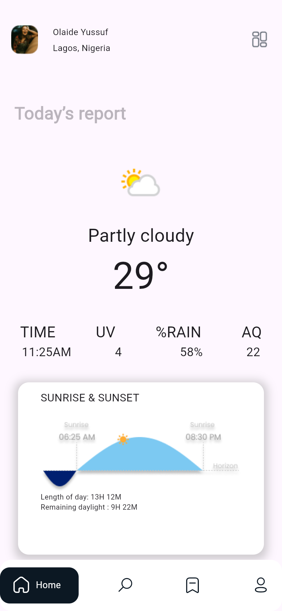
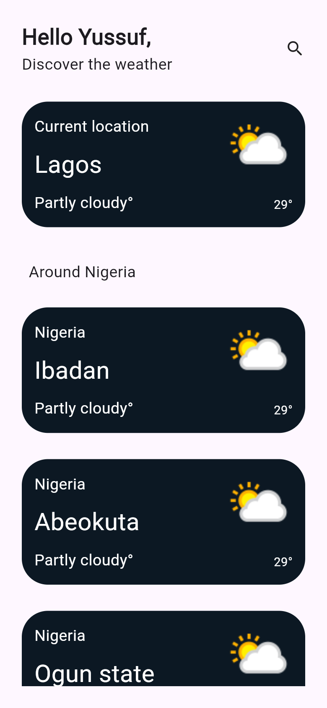
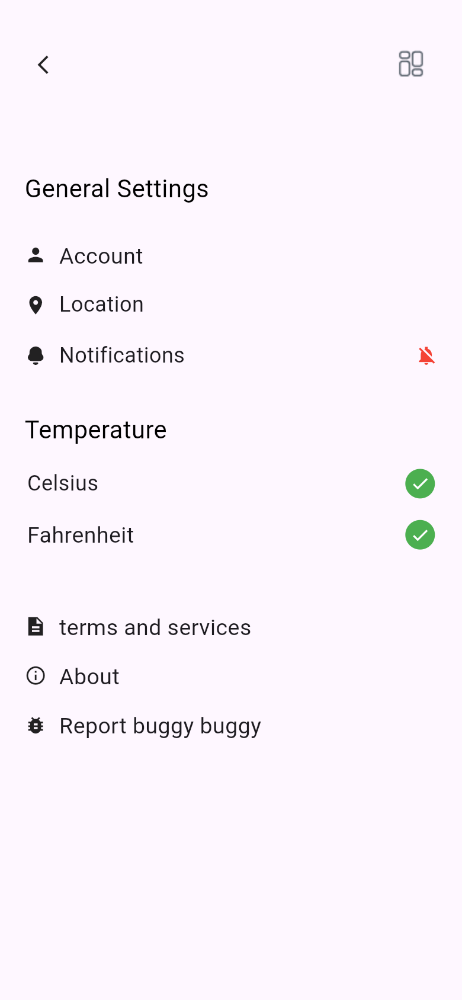

# Cloudy ☁️

**A clean, minimal weather app for Nigerian cities, built with Flutter.**

Cloudy shows live current conditions for Lagos on a "Today's report" dashboard and lets you browse the weather across other Nigerian cities at a glance.


## Screenshots

<table>
  <tr>
    <td align="center"><br/><sub>Welcome</sub></td>
    <td align="center"><br/><sub>Today's report</sub></td>
    <td align="center"><br/><sub>Weather around Nigeria</sub></td>
    <td align="center"><br/><sub>Settings</sub></td>
  </tr>
</table>

## Features

- **Live current weather** for Lagos from the [WeatherAPI.com](https://www.weatherapi.com/) `current.json` endpoint: condition, temperature and condition icon.
- **Cities view** that fetches live conditions for Lagos, Ibadan, Abeokuta, Ogun State and Osun State in parallel and shows them as cards.
- **Today's report dashboard** with time, UV, rain chance and air-quality tiles plus a sunrise & sunset day-length card (these tiles use static placeholder values for now).
- **Settings screen**: account, location, notifications, temperature unit (Celsius / Fahrenheit), terms, about and bug report entries (UI only).
- Welcome screen and a custom **Google-style bottom navigation bar** (Home · Search · Bookmark · Profile).

> **Status:** UI prototype. Current conditions come from a real API; the extra dashboard tiles, bookmarks and profile are not wired up yet.

## Tech stack

| Area | Packages |
| --- | --- |
| UI | Flutter Material, `google_fonts`, `flutter_screenutil`, `google_nav_bar`, `line_icons`, `flutter_iconly`, `weather_icons`, `material_design_icons_flutter` |
| State management | `stacked` (`BaseViewModel` + `ViewModelBuilder`) for the home report, `setState` for the cities list |
| Networking | `http` + `dart:convert` |

### Architecture

`BaseModel` (a Stacked `BaseViewModel`) calls the WeatherAPI endpoint, parses the JSON and notifies the home page, which binds to it through `Page1ViewModel`. The cities page issues one request per city and appends each result as it arrives.

## Project structure

```
lib/
├── main.dart                  # App entry, ScreenUtil + theme
├── splash2.dart               # Welcome screen
├── homescreen.dart            # Bottom navigation shell (GNav)
├── basemodel.dart             # Weather view model + API call
├── const.dart                 # Brand colours
├── homescreen_pages/
│   ├── page1.dart             # Today's report
│   ├── page2.dart             # Weather around Nigeria
│   ├── page3.dart             # Bookmarks (placeholder)
│   └── page4.dart             # Settings
└── widgets/
images/                        # Illustrations and weather artwork
```

## Getting started

```bash
git clone https://github.com/Mickool17/cloudy.git
cd cloudy
flutter pub get
flutter run            # Android / iOS
flutter run -d chrome  # Web
```

Requires Flutter 3.x (Dart 3). The WeatherAPI key lives in `lib/basemodel.dart` and `lib/homescreen_pages/page2.dart`. Swap in your own key from weatherapi.com.

## Author

**Oladimeji Micheal Tomisin**, Full-Stack & AI Engineer · GitHub: [@Mickool17](https://github.com/Mickool17)
